# LLM 面试手撕代码大全

> 大模型面试必备：从注意力机制到强化学习，从零实现核心组件

[]()
[]()
[]()

## 目录

- [项目简介](#项目简介)
- [项目结构](#项目结构)
- [注意力机制](#注意力机制)
  - [Scaled Dot-Product Attention](#scaled-dot-product-attention)
  - [Multi-Head Attention](#multi-head-attention)
  - [Group Query Attention](#group-query-attention)
  - [Multi-Latent Attention](#multi-latent-attention)
- [归一化层](#归一化层)
  - [LayerNorm](#layernorm)
  - [RMSNorm](#rmsnorm)
- [位置编码](#位置编码)
  - [Rotary Position Embedding (RoPE)](#rotary-position-embedding-rope)
- [前馈网络](#前馈网络)
  - [FFN](#ffn)
  - [SwiGLU](#swiglu)
  - [Mixture of Experts](#mixture-of-experts)
- [损失函数](#损失函数)
  - [Pretrain Loss](#pretrain-loss)
  - [SFT Loss](#sft-loss)
  - [DPO Loss](#dpo-loss)
  - [PPO Loss](#ppo-loss)
  - [GRPO Loss](#grpo-loss)
- [参数高效微调](#参数高效微调)
  - [LoRA](#lora)
- [CUDA 手撕题](#cuda-手撕题)
  - [SM90 FP8 1D2D Persistent GEMM](#sm90-fp8-1d2d-persistent-gemm)
- [参考文献](#参考文献)

## 项目简介

本项目收录了大语言模型（LLM）面试中高频出现的手撕代码实现，涵盖：

- **注意力机制**：MHA、GQA、MLA 等现代注意力变体
- **归一化层**：LayerNorm、RMSNorm
- **位置编码**：RoPE 旋转位置编码
- **前馈网络**：FFN、SwiGLU、MoE
- **损失函数**：Pretrain、SFT、DPO、PPO、GRPO 等训练损失
- **参数高效微调**：LoRA
- **CUDA Kernel**：CUTE C++/DeepGEMM SM90 WGMMA GEMM，包含 FP8 1D2D persistent kernel

**项目特色**：
- Python 组件从零实现；CUDA 示例显式标注所需底层依赖
- 详细注释，张量形状图解
- 公式推导，原理解析

---

## 写给深度学习初学者

初学深度学习时，我常感到困惑：为什么对相同的张量做同样的操作，得到的结果却不同？比如 Q、K、V 三个矩阵的形成过程，代码完全一致，却产生不同的表达。

后来我逐渐理解：**张量操作的代码是相同的，但运行时权重矩阵的参数不同**。这些参数的更新由反向传播自动完成，我们无法直接控制。如果想深入了解参数是如何形成的，需要学习反向传播的原理。我们能做的是学会正确操作张量，设计合理的计算图，让反向传播按照预期方向更新参数。

仔细观察这些代码，你会发现**它们大多是在进行维度变化和对齐的操作**——reshape、transpose、expand、concatenate……掌握这些操作，就能理解数据在网络中是如何流动的。

因此，掌握这些 LLM 组件的本质是**理解并记忆各种张量操作**。面试手撕代码时，考察的重点也是张量操作和原理的记忆，而非参数如何形成。**张量操作是理解这一切的基础**。

为此，我专门准备了一个教程：[PyTorch 张量变换与重塑教程](pytorch_tensor_reshape.ipynb)

---

## 项目结构

```
LLM-Interview-Code/
├── attention/                     # 注意力机制
│   ├── ScaledDotProductAttention.py
│   ├── MultiHeadAttention.py
│   ├── GroupQueryAttention.py
│   └── MultiLatentAttention.py
├── normalization/                 # 归一化层
│   ├── LayerNorm.py
│   └── RMSNorm.py
├── position/                      # 位置编码
│   └── RotaryEmbedding.py
├── ffn/                           # 前馈网络
│   ├── FFN.py
│   ├── SwiGLUFFN.py
│   └── MoE.py
├── loss/                          # 损失函数
│   ├── SFTLoss.py
│   ├── DPOLoss.py
│   ├── PPOLoss.py
│   ├── GRPOLoss.py
│   ├── PretainLoss.py
│   └── EntropyLoss.py
├── peft/                          # 参数高效微调
│   └── LoRALinear.py
├── cuda/                          # CUDA Kernel 手撕题
│   ├── sm90_fp8_persistent_1d2d.cu
│   ├── CMakeLists.txt
│   └── README.md
├── pytorch_tensor_reshape.ipynb   # PyTorch 张量操作教程
└── README.md
```

---

## 注意力机制

> **实现说明**
> 本仓库里的注意力模块默认使用 `dropout_p=0.0`，更贴近近两年主流 decoder-only LLM 的常见配置。
> 如果你是为了讲解经典 Transformer 正则化，或者在小数据训练中想显式增加随机性，可以手动传入非零 dropout。

### Scaled Dot-Product Attention

#### 背景与动机

缩放点积注意力（Scaled Dot-Product Attention）是所有注意力机制的基础。它计算 Query 和 Key 的点积，除以缩放因子后通过 softmax 得到注意力权重，最后加权求和 Value。

这是理解多头注意力的前提，也是面试中最常考的基础版本。

#### 核心公式

$$\text{Attention}(Q, K, V) = \text{softmax}\left(\frac{QK^T}{\sqrt{d_k}}\right)V$$

**为什么需要缩放？**
- 当 $d_k$ 较大时，点积结果也会很大
- 过大的值进入 softmax 后会导致梯度消失
- 除以 $\sqrt{d_k}$ 使方差稳定在 1 附近

#### 张量形状流程图

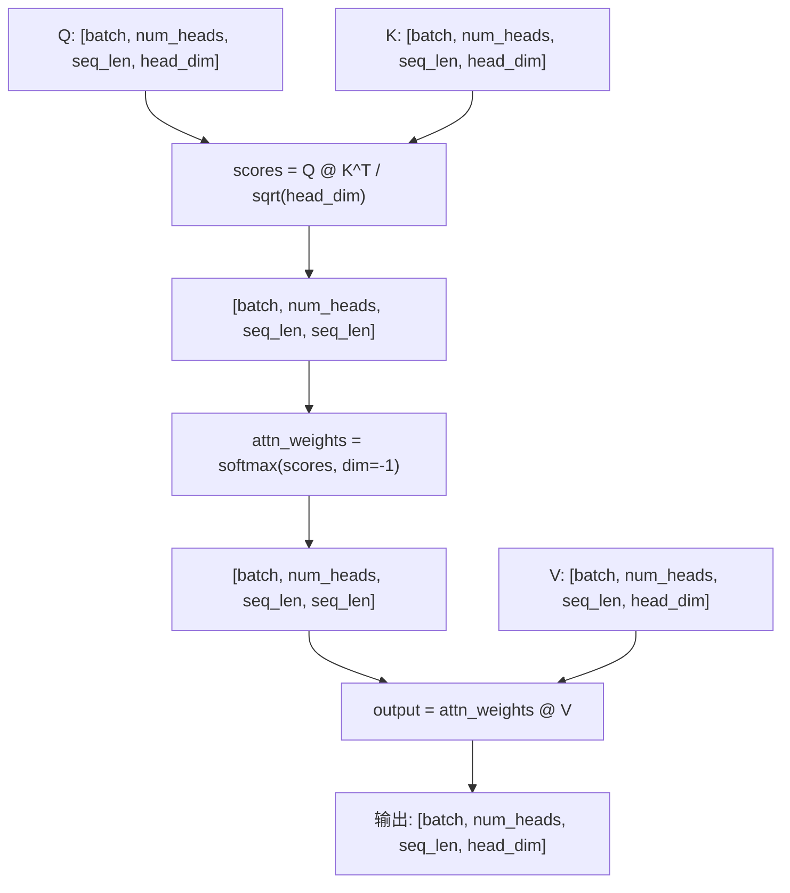

---

### Multi-Head Attention

#### 背景与动机

多头注意力（Multi-Head Attention, MHA）通过将输入映射到多个子空间并行计算注意力，模型可以同时关注不同位置的不同表示子空间信息。

每个头学习不同的注意力模式，最后拼接并通过输出投影融合。

#### 核心公式

$$\text{MultiHead}(Q, K, V) = \text{Concat}(\text{head}_1, ..., \text{head}_h)W^O$$

其中 $\text{head}_i = \text{Attention}(QW_i^Q, KW_i^K, VW_i^V)$

#### 张量形状流程图

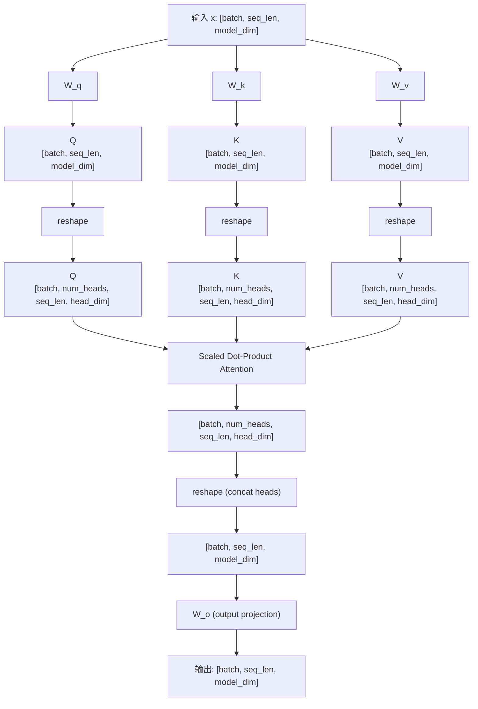

---

### Group Query Attention

#### 背景与动机

分组查询注意力（Grouped Query Attention, GQA）是 MHA 和 Multi-Query Attention (MQA) 的折中方案。在 GQA 中，Query 有 H 个头，而 Key 和 Value 只有 G 个头（G < H），多组 Query 共享同一组 K/V。

这显著减少了 KV Cache 的显存占用，同时保持了较好的模型质量。LLaMA 2、LLaMA 3 等模型都采用了 GQA。

**对比**：
| 类型 | Q 头数 | K 头数 | V 头数 | KV Cache |
|------|--------|--------|--------|----------|
| MHA | H | H | H | 100% |
| GQA | H | G | G | G/H × 100% |
| MQA | H | 1 | 1 | 1/H × 100% |

#### 核心公式

与 MHA 相同，但 K、V 需要通过 `repeat_kv` 扩展到与 Q 相同的头数：

```
K_expanded = repeat(K, num_heads // num_kv_heads)
V_expanded = repeat(V, num_heads // num_kv_heads)
```

#### 张量形状流程图

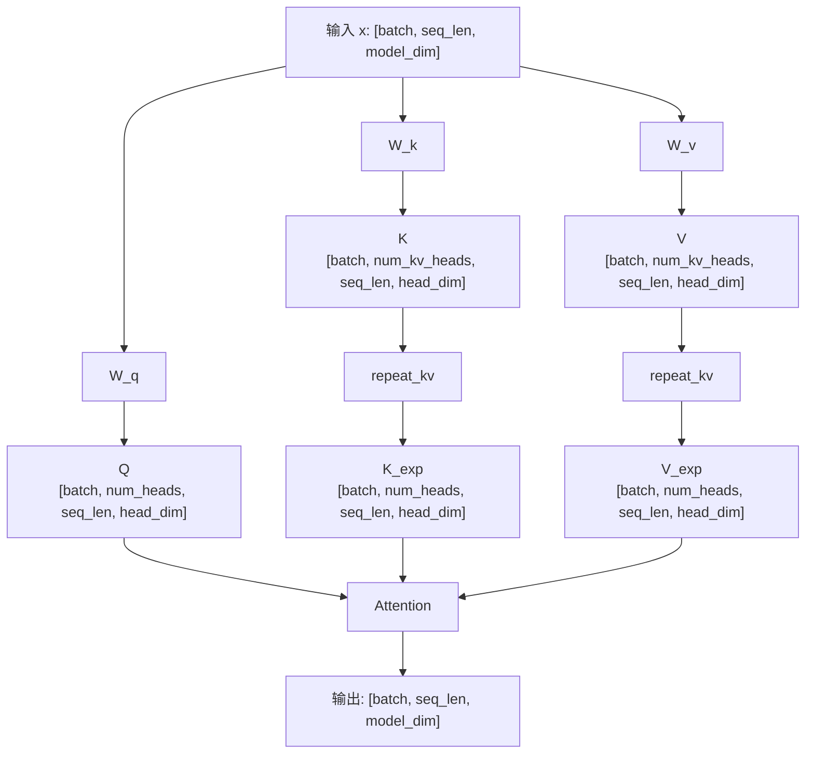

---

### Multi-Latent Attention

> **实现说明**
> `MultiLatentAttention.py` 是用于讲解核心张量变换的简化版 MLA：保留 Q/KV
> 低秩投影与 RoPE 注意力主线，但未实现原论文中的共享解耦 RoPE Key、
> 投影吸收和增量 KV Cache 接口。

#### 背景与动机

多潜变量注意力（Multi-Latent Attention, MLA）由 DeepSeek-V2 提出，通过将 KV 压缩到低维潜空间来大幅减少 KV Cache。与 GQA 不同，MLA 不是通过减少头数，而是通过降维压缩来实现内存节省。

**核心思想**：
- KV 先通过下投影压缩到潜空间（存入 Cache）
- 计算注意力时再上投影恢复
- 压缩比可达 90%+，同时保持性能

#### 核心公式

**KV 压缩**（下投影到潜空间）：

$$c_{KV} = W_{DKV} \cdot h_t$$

**KV 恢复**（上投影恢复 K、V）：

$$[k_{t}, v_{t}] = W_{UKV} \cdot c_{KV}$$

#### 张量形状流程图

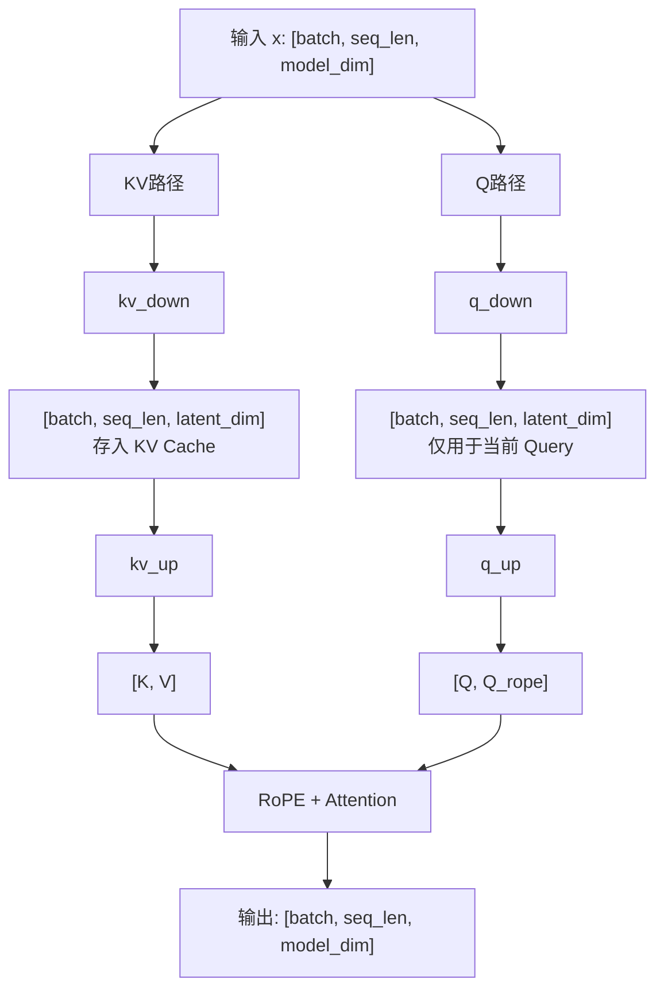

---

## 归一化层

### LayerNorm

#### 背景与动机

层归一化（Layer Normalization）在每个样本的特征维度上进行归一化，使得训练更加稳定。与 BatchNorm 不同，LayerNorm 不依赖 batch size，因此更适合序列模型和 Transformer。

#### 核心公式

$$\text{LN}(x) = \gamma \cdot \frac{x - \mu}{\sqrt{\sigma^2 + \epsilon}} + \beta$$

其中：
- $\mu = \frac{1}{d}\sum_{i=1}^{d} x_i$ （均值）
- $\sigma^2 = \frac{1}{d}\sum_{i=1}^{d} (x_i - \mu)^2$ （方差）
- $\gamma, \beta$：可学习的缩放和偏移参数

#### 张量形状流程图

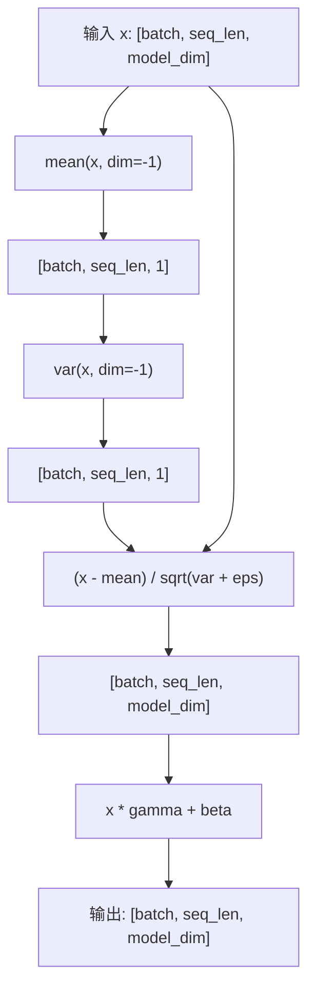

---

### RMSNorm

#### 背景与动机

均方根归一化（Root Mean Square Normalization）是 LayerNorm 的简化版本。它移除了均值计算，只使用 RMS 进行归一化。这种方法计算更快，且在很多 LLM（如 LLaMA、Mistral）中表现优异。

#### 核心公式

$$\text{RMSNorm}(x) = \gamma \cdot \frac{x}{\sqrt{\frac{1}{d}\sum_{i=1}^{d} x_i^2 + \epsilon}}$$

**与 LayerNorm 的区别**：
- 不计算均值（去中心化）
- 只有一个可学习参数 $\gamma$（无 $\beta$）
- 计算量更少，推理更快

#### 张量形状流程图

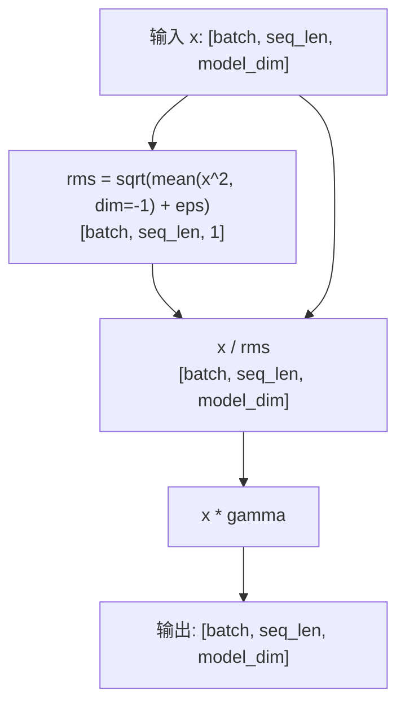

---

## 位置编码

### Rotary Position Embedding (RoPE)

#### 背景与动机

旋转位置编码（RoPE）通过旋转向量的方式注入位置信息，具有以下优势：
- **相对位置感知**：自动捕捉 token 之间的相对位置关系
- **外推能力**：可以处理比训练时更长的序列
- **计算高效**：通过逐元素乘法实现

目前被 LLaMA、Mistral、Qwen 等主流模型采用。

#### 核心公式

对于位置 $m$ 的向量 $x$，RoPE 将其旋转：

```math
\begin{bmatrix}
x_1' \\
x_2'
\end{bmatrix}
=
\begin{bmatrix}
\cos(m\theta) & -\sin(m\theta) \\
\sin(m\theta) & \cos(m\theta)
\end{bmatrix}
\cdot
\begin{bmatrix}
x_1 \\
x_2
\end{bmatrix}
```

展开形式：

$$x_1' = x_1 \cos(m\theta) - x_2 \sin(m\theta)$$

$$x_2' = x_1 \sin(m\theta) + x_2 \cos(m\theta)$$

其中 $\theta_i = 10000^{-2i/d}$

#### 实现原理

```
位置 m 的旋转角度: θ_m = m * θ_base
预计算 cos(m*θ) 和 sin(m*θ) 用于所有位置

旋转公式:
[x1', x2'] = [x1*cos - x2*sin, x1*sin + x2*cos]

等价于:
x' = x * cos + rotate_half(x) * sin
其中 rotate_half(x) = [-x后半, x前半]
```

#### 张量形状流程图

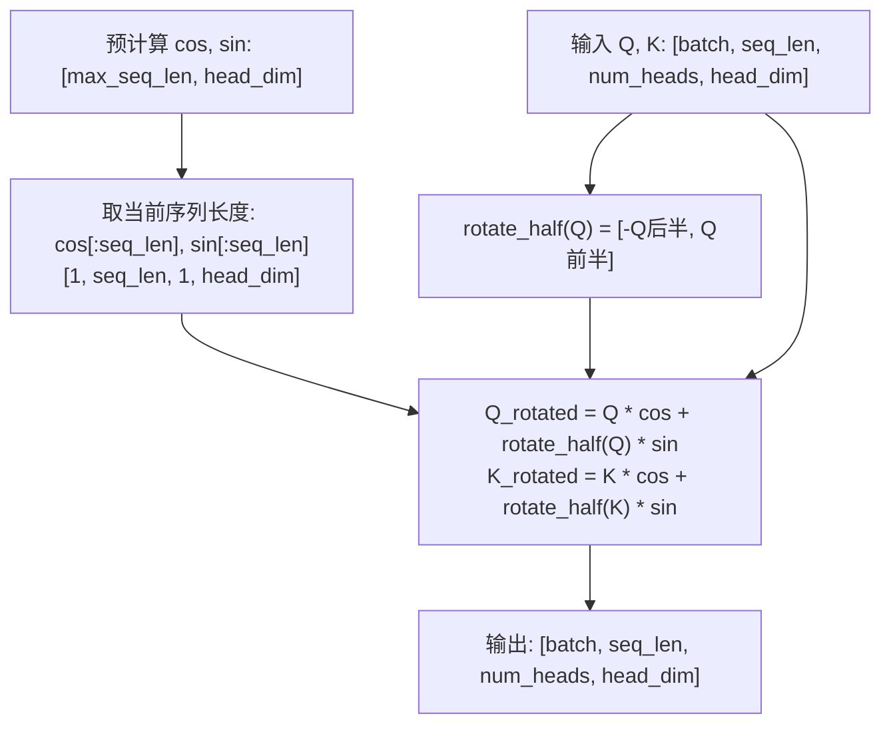

---

## 前馈网络

### FFN

#### 背景与动机

前馈网络（Feed-Forward Network）是 Transformer 中注意力层之后的两层全连接网络，用于对特征进行非线性变换。它是 Transformer 中参数量最大的部分。

#### 核心公式

$$\text{FFN}(x) = W_2 \cdot \text{ReLU}(W_1 x)$$

通常 $d_{ff} = 4 \times d_{model}$

#### 张量形状流程图

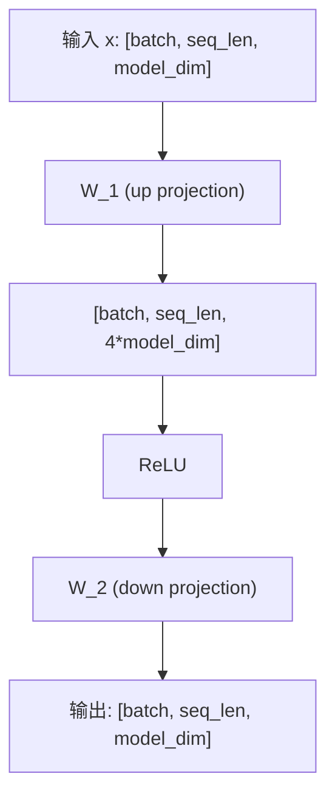

---

### SwiGLU

#### 背景与动机

SwiGLU 是 GLU（Gated Linear Unit）变体之一，被 LLaMA、PaLM 等模型采用。相比标准 FFN，SwiGLU 引入门控机制和 Swish 激活函数，提升了模型性能。

#### 核心公式

$$\text{SwiGLU}(x) = (W_{gate}(x) \odot \text{SiLU}(W_{up}(x))) \cdot W_{down}$$

其中：
- $\text{SiLU}(x) = x \cdot \sigma(x)$ （也称为 Swish）
- $\odot$ 表示逐元素乘法

**参数量对比**：标准 FFN 有 2 个矩阵，SwiGLU 有 3 个矩阵

#### 张量形状流程图

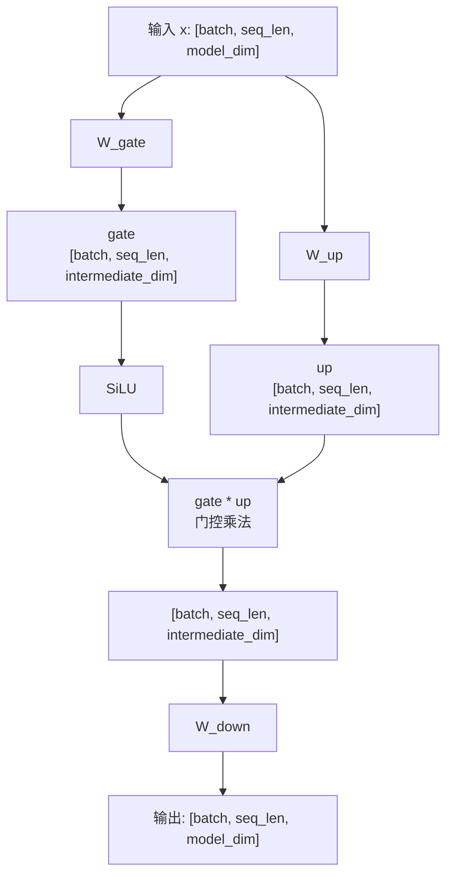

---

### Mixture of Experts

#### 背景与动机

混合专家模型（Mixture of Experts, MoE）通过稀疏激活实现模型容量的极大扩展。每个 token 只激活部分专家网络，使得总参数量可以很大，但计算量保持可控。

**核心思想**：
- Router 决定每个 token 应该由哪些专家处理
- Top-K 路由：每个 token 只激活 K 个专家
- 专家输出按路由权重加权求和

代表模型：Mixtral 8x7B、DeepSeek-V2、GPT-4 等。

#### 核心公式

$$\text{MoE}(x) = \sum_{i \in \text{TopK}} \text{softmax}(\text{router}(x))_i \cdot E_i(x)$$

#### 张量形状流程图

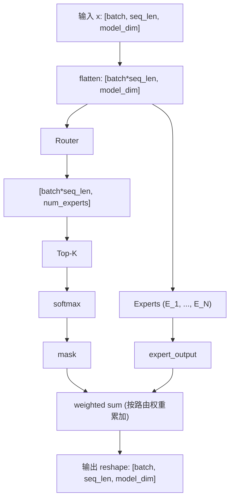

---

## 损失函数

### Pretrain Loss

#### 背景与动机

预训练损失（Pretrain Loss）是因果语言模型最基础的训练目标：给定当前位置之前的 token，预测下一个 token。除 padding 等需要忽略的位置外，序列中的所有 token 都参与损失计算。

这是所有 LLM 训练的基础，理解它是学习 SFT、DPO、PPO 等训练方法的前提。

#### 核心公式

$$\mathcal{L}_{\text{Pretrain}} = -\sum_{t=2}^{T} \log P(x_t \mid x_{<t})$$

#### 张量形状流程图

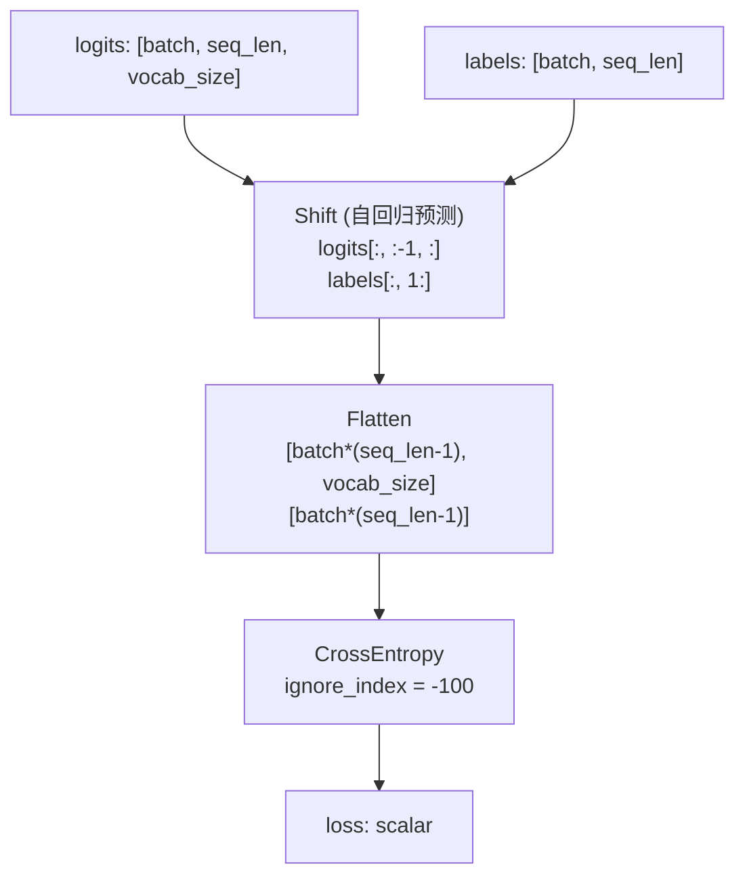

---

### SFT Loss

#### 背景与动机

监督微调（Supervised Fine-Tuning, SFT）损失是带 prompt 掩码的交叉熵损失。在指令微调中，通常只计算 response 部分的损失，不计算 prompt 部分。

如果只看损失函数的实现，SFT Loss 与 Pretrain Loss 的 next-token Cross Entropy 完全相同，唯一的实质差异是 **mask**：

| | Pretrain Loss | SFT Loss |
|---|---|---|
| 参与损失的 token | 所有未被忽略的 token | 仅 response token |
| prompt label | 正常参与损失 | 设为 `-100`，不参与损失 |
| Shift + CrossEntropy | 相同 | 相同 |

两者的训练阶段和数据形式不同，但损失计算的主干没有变化。

#### 核心公式

$$\mathcal{L}_{SFT} = -\sum_{t=p}^{T} \log P(y_t | x, y_{<t})$$

其中 $p$ 是 prompt 长度，即只对 response 部分计算损失。

#### 张量形状流程图

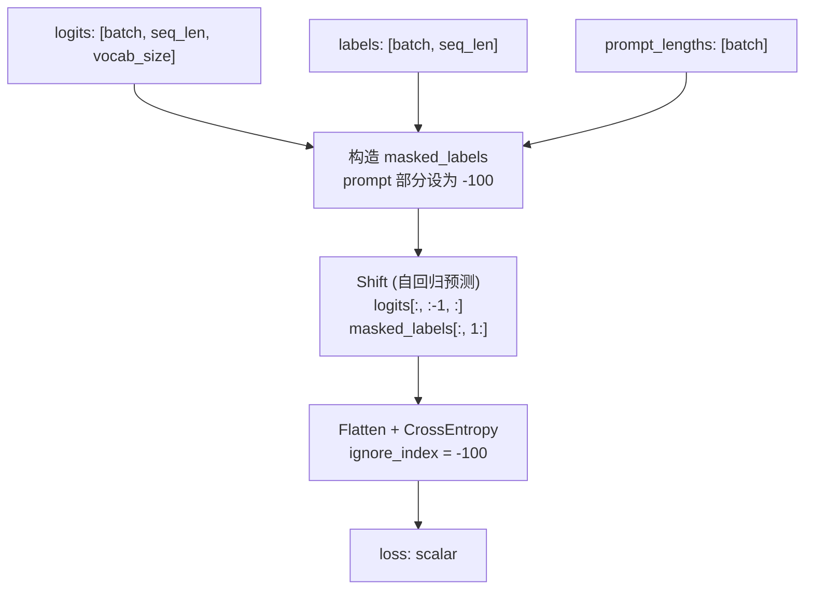

---

### DPO Loss

#### 背景与动机

直接偏好优化（Direct Preference Optimization, DPO）是一种无需奖励模型的 RLHF 替代方案。它直接在偏好数据上优化策略，简化了训练流程。

**核心思想**：增加 chosen 回答的概率，降低 rejected 回答的概率

#### 核心公式

$$\mathcal{L}_{DPO} = -\mathbb{E}\left[\log \sigma\left(\beta \left(\log \frac{\pi_\theta(y_w|x)}{\pi_{ref}(y_w|x)} - \log \frac{\pi_\theta(y_l|x)}{\pi_{ref}(y_l|x)}\right)\right)\right]$$

其中：
- $y_w$：chosen（优选）回答
- $y_l$：rejected（拒绝）回答
- $\pi_\theta$：当前策略
- $\pi_{ref}$：参考策略（通常是 SFT 模型）
- $\beta$：KL 散度约束系数

---

### PPO Loss

#### 背景与动机

近端策略优化（Proximal Policy Optimization, PPO）通过裁剪重要性采样比率来限制策略更新幅度，防止策略崩溃。是 RLHF 训练的核心算法。

#### 核心公式

$$\mathcal{L}_{PPO} = \mathbb{E}\left[\min\left(r_t(\theta) \hat{A}_t, \text{clip}(r_t, 1-\epsilon, 1+\epsilon)\hat{A}_t\right)\right]$$

其中：
- $r_t = \frac{\pi_\theta(a_t|s_t)}{\pi_{\theta_{old}}(a_t|s_t)}$（重要性采样比率）
- $\hat{A}_t$：优势函数估计
- $\epsilon$：裁剪参数（通常 0.2）

#### 裁剪机制图解

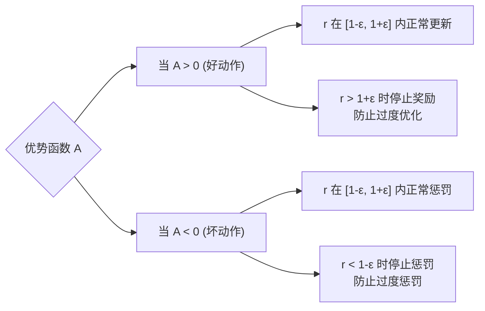

---

### GRPO Loss

#### 背景与动机

分组相对策略优化（Group Relative Policy Optimization, GRPO）是 DeepSeek-Math 提出的算法，被 DeepSeek-R1 用于强化学习训练。它通过组内相对优势来消除对价值网络（Critic）的依赖。

**核心思想**：
- 对同一问题生成多个回答（组）
- 在组内计算相对优势（而非绝对优势）
- 无需训练 Critic 网络，简化训练流程

#### 核心公式

**1. 组内相对优势（Group-Relative Advantage）**

对同一问题生成 $G$ 个回答，计算每个回答的奖励 $r_1, r_2, ..., r_G$，然后计算组内标准化优势：

$$\hat{A}_i = \frac{r_i - \text{mean}(\mathbf{r})}{\text{std}(\mathbf{r})}$$

**2. GRPO 损失函数**

$$\mathcal{L}_{GRPO} = -\mathbb{E}\left[\frac{1}{G}\sum_{i=1}^{G} \min\left(\rho_i \hat{A}_i, \text{clip}(\rho_i, 1-\epsilon, 1+\epsilon)\hat{A}_i\right) - \beta \cdot \mathbb{D}_{KL}\right]$$

其中：
- $\rho_i = \frac{\pi_\theta(o_i|q)}{\pi_{\theta_{old}}(o_i|q)}$（重要性采样比率）
- $\hat{A}_i$：组内相对优势
- $\beta$：KL 散度惩罚系数
- $\mathbb{D}_{KL}$：策略与参考策略的 KL 散度

#### 与 PPO 的区别

| 特性 | PPO | GRPO |
|------|-----|------|
| 优势估计 | 需要 Critic 网络 | 组内相对优势 |
| 额外网络 | 需要 Value Head | 不需要 |
| 内存占用 | 较高 | 较低 |
| 适用场景 | 通用 RL | 多候选生成场景 |

---

## 参数高效微调

### LoRA

#### 背景与动机

低秩适应（Low-Rank Adaptation, LoRA）通过在预训练权重旁添加低秩分解矩阵来实现参数高效微调。它冻结预训练权重，只训练少量参数，大大降低了微调成本。

**核心思想**：权重更新 $\Delta W$ 可以被低秩分解为 $B \cdot A$

#### 核心公式

$$h = W_0 x + \Delta W x = W_0 x + BAx$$

其中：
- $W_0 \in \mathbb{R}^{d \times k}$：冻结的预训练权重
- $A \in \mathbb{R}^{r \times k}$：可训练，使用随机初始化
- $B \in \mathbb{R}^{d \times r}$：可训练，初始化为零
- $r \ll \min(d, k)$：低秩维度

**关键设计**：$B$ 初始化为零，使得初始状态 $BA = 0$，保证微调开始时模型行为不变。

#### 张量形状流程图

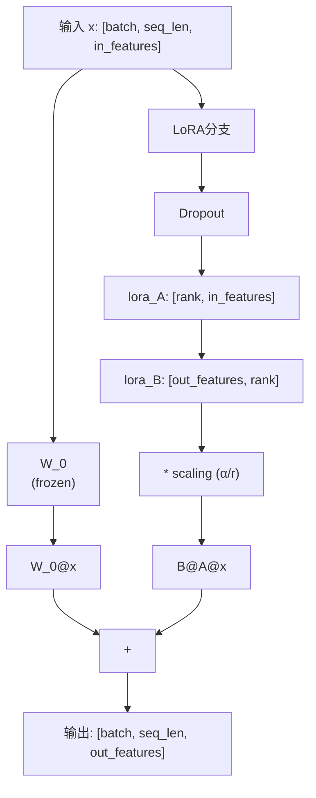

---

## CUDA 手撕题

### SM90 FP8 1D2D Persistent GEMM

[`cuda/sm90_fp8_persistent_1d2d.cu`](cuda/sm90_fp8_persistent_1d2d.cu) 是一份面试手撕导向的 kernel 本体，参照 DeepGEMM 的 SM90 FP8 1D2D 实现编写。

代码展示了 A/B/SFA/SFB 的数据约定、CUTE global/shared layout、persistent scheduler、TMA 多 stage pipeline、warp specialization、WGMMA 主循环和 FP32 scale promotion。为了突出主干，它固定 `64x128x128` tile 并省略边界、cluster multicast 和完整 TMA epilogue。数据/layout 图解见 [`cuda/README.md`](cuda/README.md)。

---

## 参考文献

### 注意力机制
- [Attention Is All You Need](https://arxiv.org/abs/1706.03762) - Transformer / MHA
- [GQA: Training Generalized Multi-Query Transformer Models](https://arxiv.org/abs/2305.13245) - GQA
- [DeepSeek-V2](https://arxiv.org/abs/2405.04434) - MLA

### 位置编码
- [RoFormer: Rotary Position Embedding](https://arxiv.org/abs/2104.09864) - RoPE

### 归一化
- [Layer Normalization](https://arxiv.org/abs/1607.06450)
- [Root Mean Square Layer Normalization](https://arxiv.org/abs/1910.07467)

### 前馈网络
- [GLU Variants Improve Transformer](https://arxiv.org/abs/2002.05202) - SwiGLU
- [Outrageously Large Neural Networks: The Sparsely-Gated Mixture-of-Experts Layer](https://arxiv.org/abs/1701.06538) - MoE
- [Mixtral of Experts](https://arxiv.org/abs/2401.04088) - MoE

### 训练方法
- [Direct Preference Optimization](https://arxiv.org/abs/2305.18290) - DPO
- [Proximal Policy Optimization](https://arxiv.org/abs/1707.06347) - PPO
- [DeepSeekMath](https://arxiv.org/abs/2402.03300) - GRPO
- [DeepSeek-R1](https://arxiv.org/abs/2501.12948) - GRPO

### 参数高效微调
- [LoRA: Low-Rank Adaptation](https://arxiv.org/abs/2106.09685)

---
